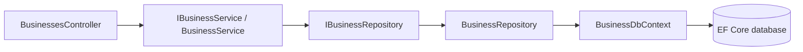

# BusinessIQ architecture and Framework reuse

BusinessIQ uses a layered architecture with an executable Business management slice:

Interfaces belong to Application. Infrastructure implements persistence. Domain and Contracts have no dependency on ASP.NET Core or EF Core. API is the composition root and may reference Infrastructure to register implementations; controllers never query a DbContext.

## Layers and reused base types

| BusinessIQ layer | Responsibility | Framework reuse |
| --- | --- | --- |
| Domain | Business entity and organization ownership | `BaseEntity<Guid>`, `IEntity<Guid>` |
| Contracts | Create/update/detail/grid DTOs | `BaseDto<Guid>`, `IEntityContract<Guid>`, `PagedRequest`, `PageResponse<T>`, `CommonResult<T>`, `EntityIdResponse<T>` |
| Application | Service and repository interfaces, validation, mappings, AI profiles | `IBaseService`, `BaseService`, `IBaseRepository`, shared knowledge services |
| Infrastructure | EF model, tenant query filter, persistence guard, archive semantics | `BaseRepository<Business, Guid, BusinessDbContext>` |
| API | Thin concrete controller, authentication, organization selection, DI | `Framework.Web.BaseControllerCRUD` and inherited read-only methods |

Actual controller types are in the `Framework.Web.Controllers` namespace. Framework.Web is a reusable class library with an ASP.NET Core framework reference; BusinessIQ does not reference the runnable Framework.Api host. The old host controller names remain as compatibility facades.

Framework's repository accepts a third generic context parameter. The original two-parameter repository still selects FrameworkDbContext for the reference application. BusinessDbContext inherits FrameworkDbContext and calls its model configuration before applying BusinessIQ mappings and tenant filters. FrameworkDbContext exposes a protected options constructor for derived contexts while retaining its public typed constructor for the reference host. BusinessIQ entities remain in BusinessIQ.

## Concrete request behavior

`BusinessesController` inherits get-by-ID, filtered search, create, update and delete. It declares routing and authorization only. `BusinessService` inherits shared reads, writes and mapping behavior, adding input validation. `BusinessRepository` inherits shared EF reads, projection, pagination and writes. The application context enforces organization filtering and write ownership; delete archives the record instead of physically removing it.

AutoMapper profiles live in Application. Create/update mappings trim text and ignore server-owned ID, OrganizationId and archive state. Read mappings serve detail/grid responses; the shared repository uses `ProjectTo` for queries. DTOs use data annotations for HTTP validation, and the service validates business input for non-HTTP callers. Detached bulk service updates are deliberately unsupported until an authorized transactional use case is defined.

`AddBusinessApplication()` composes Framework's `AddApplication()`, replaces the generic document profile catalog, registers application mappings, and binds business services. `AddBusinessInfrastructure()` registers the application context/repository. API registers an `ICurrentOrganization` implementation based on the current request.

## Access boundaries

All Business management endpoints require organization `owner` access outside Development. The identity issuer is responsible for issuing that organization-wide role appropriately. Manager-level business/location permissions are not implemented, so manager tokens cannot use these endpoints merely because they can ingest documents.

A single valid `tenant_id` GUID claim selects the organization automatically. A token with multiple memberships must select `X-Organization-Id`, and the selected value must match a claim. Unauthenticated Development requests must supply that header. It is never accepted as proof of membership outside Development.

The EF query filter excludes other organizations and archived rows. Write DTOs cannot set tenant ownership. SaveChangesAsync stamps new ownership and checks persisted ownership before modifications, including detached writes. Sync saves are disabled so callers use the guarded async path. IgnoreQueryFilters is reserved for trusted infrastructure/admin code, not exposed by the controller. Organization and membership records are still future work; claims are the current authority.

## Database modes and limitations

Development defaults to an EF Core in-memory store scoped to the API host. It resets on restart and is not durable. PostgreSql and SqlServer providers are configured with `Database__Provider` and `ConnectionStrings__DefaultConnection`. Outside Development, PostgreSql is the default and InMemory is rejected. A business request requires a configured connection and an existing schema; migrations, design-time tooling and provisioning are not supplied yet. No automatic database creation or migration runs at startup.

The first entity contains ID, OrganizationId, Name, Industry and IsArchived. It establishes the reusable architecture; it is not the complete roadmap domain. Organization onboarding, Location entities, audit records, relationships, concurrency controls, industry modules and financial workflows remain future work.

## AI is a separate use case

Document controllers use shared Framework ingestion/answer services, which use AI index/retrieval/model ports and Local/Azure implementations. Document retrieval is not an EF CRUD repository. Keep these abstractions instead of adding a redundant database repository around the vector store. AutoMapper also maps document profile responses.

The current knowledge API uses TenantId and optional ScopeId; it does not encode both Business and Location or validate their hierarchy. Do not use a null scope as a shortcut to all businesses. Build consolidated views from explicitly authorized records and deterministic metrics.

## Financial and industry boundaries

The target model remains User -> Organization -> Business -> Location. Business-specific entities and workflows belong here, while generic reusable components belong in Framework.

Source records -> validated structured data -> deterministic financial services -> verified metrics -> authorized AI context -> explanation and recommendations.

Use decimal amounts and explicit currencies/rounding, audit sensitive actions, preserve timestamps/time zones, and implement transactional financial workflows. An LLM must not become the ledger, tax engine or authoritative calculator. Forecasts expose assumptions and uncertainty. Industry modules extend the common core. These are design requirements for future modules, not completed features.

## Tests

Integration tests execute inherited CRUD, projections and mappings, pagination, validation, tenant isolation, archive persistence, production role/membership checks and existing AI flows. Architecture checks verify dependency boundaries and shared base-class inheritance. Framework's own test suite validates the reusable-library changes against its existing host.
